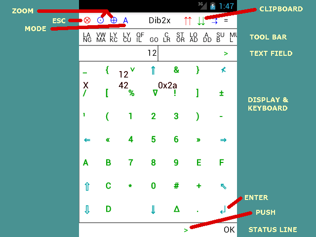

Dib2Calc (aka Dibdib Calculator)
========

The crazy calculator. Once you get used to it, you will love it :-)

Some **additional information**:

    Note: This is a very early version. Do expect some major changes, and,
    unfortunately, also a lack of user documentation. Use it for 'playing',
    for the clipboard, and for contributing ... :-)

Basic ideas:

- Instead of having the display reduce the size of the virtual keyboard, and
  having the keyboard cover important parts of the display, the whole display
  is used for typing.
- Data is not only numbers, but also words. This calculator will provide some
  minimalistic word processing and binary representation.
- A value ('scalar') can be viewed as a single element of a 'sequence' (atomic
  vector). E.g., a sentence is viewed as a sequence of words, and a word is
  treated like a sentence with just that one word.
- Instead of calculating '(3 + 4) * 5' or the corresponding Lisp notation,
  the simple postfix (RPN) notation is used: '3 4 + 5 *'.

Usage:

- Currently, the 'long click' does not work.
- A SWIPE does not work. Use the blue keys on the 4 sides instead (SCROLL).
- ESC (see figure) resets the view, a long click will exit (not yet).
- The main view is an overlay of keyboard buttons (blue and green) and the
  displayed lines of the calculator's stack (black): '12' is the value of the
  text field, '42' the top value ('X') of the stack (with 42 = 0x2a).
- The ZOOM buttons change the text size (currently only by factor 2).
- The MODE button changes the way of handling the virtual keyboard and the
  display.
- The first toolbar button LA-NG switches the language.
- The second button indicates and switches the view (VW). This will take you
  to experimental mappings, then to the current list of operators, to the
  license, and back.
- The layer (LY) buttons are not fully implemented yet.
- The filter (QF-IL) applies to stored data mappings (experimental).
- GO is the button for applying (executing) operators (commands). Only some
  basic operators ('+', '-', '*', '/', ...) work immediately (i.e. without
  'GO').
- The blue keys of the keyboard: SCROLL (4), BACKSP, SHIFT (2+1), ENTER.

If it gets 'stuck' due to some cut-down:

- First go to the device's settings, clear the app data, and try again.
- If it still cannot load your data, then open a file manager, rename the
'Download/dibdib' folder (e.g. to 'Download/dd_OLD'), and start the app
a-fresh.

Try it out:

- When you run the app the first time, follow the short introduction.
- At the end you will realize that pressing the PUSH button for an empty text
  field will duplicate the top value.
- Then type '3 4 5 42' as a sequence with blanks, then PUSH, then '2', PUSH,
  and finally '*'. This multiplies each value of the sequence by 2.
- Press the 'VW' button ('VM-MA') to switch the view. Before getting back, you
  will find a list of the available operators. (Not all are fully implemented)
- Try the (blue) SHIFT keys (SHIFT-UP, SHIFT-DOWN): This will give you access
  to more characters.
- Try some letters followed by the extra SHIFT key (above ENTER). This will take
  you to corresponding international (Unicode) characters.
- You can exchange data with other apps via the CLIPBOARD (top right).

Your data is protected (encrypted) if you use your own access code and
password. In case you have a lot of data, make sure to save it to the device's
Download area via the SAVTO function.

The app requires some extra processing in the background (e.g. for loading and
saving). Depending on your system settings, this might cause a few 'hiccups'
for the time being ...

An installable APK file can be downloaded from:

https://f-droid.org/packages/com.gitlab.dibdib.dib2calc
(for stable versions)

https://www.magentacloud.de/share/x5x-ox77lf
(for experimental (!) versions)

-----

(Cmp. https://gxworks.github.io/dibdib)

See LICENSE file (= GPLv3-or-later)
and further details under 'LICENSE_all' or 'assets' or 'resources'
(e.g. https://github.com/gxworks/dibdib/blob/master/docs/LICENSE_all)

(Impressum: https://gxworks.github.io/impressum)

